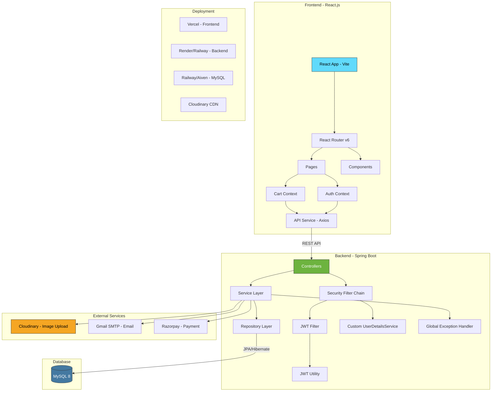
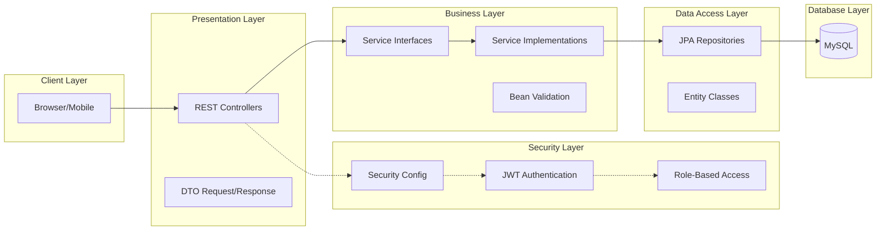

# ShopEase System Architecture

## Architecture Diagram

## Layer Architecture

## API Architecture

| Layer | Responsibility | Technologies |
|---|---|---|
| Controller | Handle HTTP requests, validate input | Spring MVC, Bean Validation |
| Service | Business logic, transaction management | Spring Service, @Transactional |
| Repository | Data access, queries | Spring Data JPA, JPQL |
| Security | Authentication, authorization | Spring Security, JWT |
| Exception | Error handling | @ControllerAdvice |
| DTO | Data transfer | Request/Response DTOs |
| Entity | Database mapping | JPA, Hibernate, Lombok |
