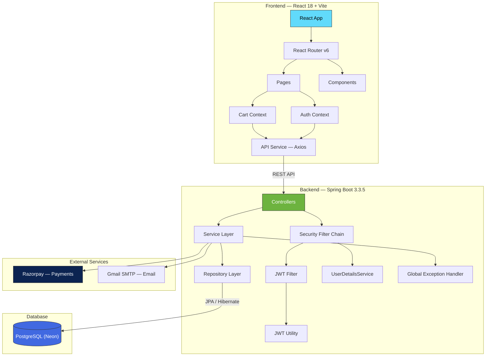
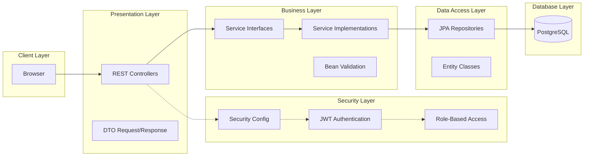
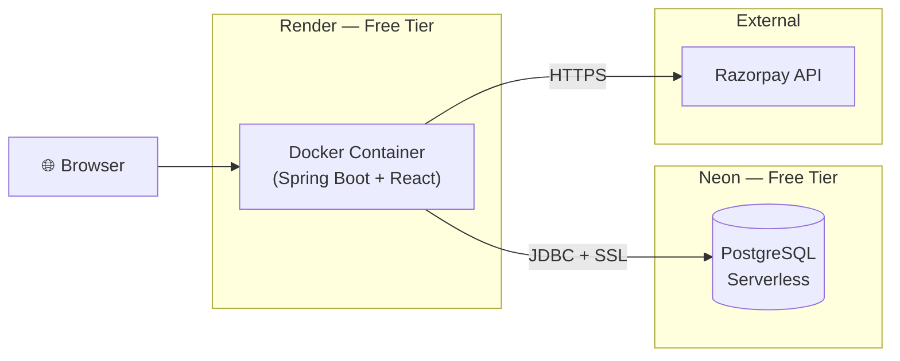

# ShopEase — System Architecture

## High-Level Architecture

## Layered Architecture

## Deployment Architecture

## API Layer Summary

| Layer | Responsibility | Technologies |
|-------|---------------|-------------|
| Controller | HTTP request handling, input validation | Spring MVC, Bean Validation |
| Service | Business logic, transactions | Spring Service, `@Transactional` |
| Repository | Data access, custom queries | Spring Data JPA, JPQL, JOIN FETCH |
| Security | Authentication & authorization | Spring Security, JWT (HS256) |
| Exception | Centralized error handling | `@ControllerAdvice`, `@ExceptionHandler` |
| DTO | Data transfer objects | Request/Response DTOs, DtoMapper |
| Entity | Database mapping | JPA, Hibernate 6, Lombok |
